<div align="center">

# 🚦 NeuroFlow

### Autonomous Traffic Control System

[](https://www.python.org/)
[](https://fastapi.tiangolo.com/)
[](https://reactjs.org/)
[](https://docs.ultralytics.com/)
[](https://docs.docker.com/compose/)
[](https://mosquitto.org/)
[](https://www.postgresql.org/)
[](LICENSE)

**Real-time vehicle detection at intersections using YOLOv8 on edge devices, with adaptive signal timing powered by density-based algorithms and a live React dashboard.**

[Architecture](#architecture) · [Features](#features) · [Quick Start](#quick-start) · [API Reference](#api-reference) · [Contributing](#contributing)

</div>

---

## Architecture

```mermaid
flowchart TD
    subgraph Edge["🔌 Edge Layer"]
        direction TB
        A["📷 CCTV Camera"]
        B["⚙️ Edge Gateway<br/>(Raspberry Pi)"]
        C["🧠 YOLOv8 Model<br/>(Object Detection)"]
        A -->|"Video Feed"| B
        B -->|"Runs"| C
    end

    subgraph Network["🌐 Network Layer"]
        direction TB
        D[/"📡 MQTT Protocol<br/>(Lightweight Messaging)"/]
    end

    subgraph Cloud["☁️ Cloud Layer"]
        direction TB
        E["🖥️ Traffic Controller<br/>Server"]
        F[("🗄️ PostgreSQL<br/>Database")]
        G["📊 React Dashboard<br/>(Visualization)"]
        E -->|"Logs Data"| F
        E -->|"Sends Updates"| G
    end

    subgraph Feedback["🔁 Feedback Loop"]
        direction TB
        H["🚦 Traffic Light<br/>Signal"]
    end

    B -->|"Sends Detection Data"| D
    D -->|"Forwards to Cloud"| E
    E -->|"Sends Command"| H
    H -.->|"Status Update"| E
```



## Features

### 🔍 Edge — Real-Time Vehicle Detection
- **YOLOv8 inference** on Raspberry Pi (or any edge device)
- Detects 4 vehicle classes: cars, trucks, buses, motorcycles
- Configurable confidence threshold and detection interval
- Automatic camera reconnection with exponential backoff

### 📡 Network — Lightweight Messaging
- **MQTT protocol** (Eclipse Mosquitto) for low-latency pub/sub
- JSON payloads with structured detection data
- Last Will and Testament (LWT) for edge device status tracking

### ☁️ Cloud — Intelligent Traffic Control
- **FastAPI** REST API + WebSocket for live streaming
- **Adaptive signal timing** — green duration scales linearly with vehicle density
- Moving-average smoothing (10-frame window) for noise reduction
- Manual override support via API or dashboard
- Full detection & signal history logged in **PostgreSQL**

### 📊 Dashboard — Live Visualization
- **React** SPA with dark-themed premium UI
- Real-time intersection map with traffic light indicators
- Vehicle count area charts, type breakdowns, and inference latency graphs (Recharts)
- Signal override control panel with command history
- WebSocket live feed with auto-reconnect

---

## Tech Stack

| Layer | Technology | Purpose |
|---|---|---|
| Edge | Python 3.11, OpenCV, Ultralytics YOLOv8 | Video capture & object detection |
| Network | Eclipse Mosquitto (MQTT) | Lightweight messaging |
| Server | FastAPI, SQLAlchemy, asyncpg | REST API, signal logic, DB |
| Database | PostgreSQL 16 | Detection & command logging |
| Dashboard | React 18, Recharts, Axios | Real-time visualization |
| Infra | Docker Compose, GitHub Actions | Orchestration & CI |

---

## Quick Start

### Prerequisites

- [Docker](https://www.docker.com/get-started) & Docker Compose
- Git

### 1. Clone & Configure

```bash
git clone https://github.com/your-username/neuroflow.git
cd neuroflow
cp .env.example .env
```

Edit `.env` to configure your camera source, model path, and database credentials.

### 2. Launch All Services

```bash
docker compose up -d --build
```

This starts 5 containers:

| Service | Port | Description |
|---|---|---|
| `neuroflow-mqtt` | 1883, 9001 | Mosquitto MQTT broker |
| `neuroflow-db` | 5432 | PostgreSQL database |
| `neuroflow-edge` | — | Edge gateway (camera + YOLO) |
| `neuroflow-server` | 8000 | FastAPI traffic controller |
| `neuroflow-dashboard` | 3000 | React dashboard |

### 3. Open the Dashboard

Navigate to **http://localhost:3000** to view the real-time dashboard.

API docs available at **http://localhost:8000/docs** (Swagger UI).

### 4. Verify Services

```bash
# Check all containers are running
docker compose ps

# View server logs
docker compose logs -f traffic-server

# View edge gateway logs
docker compose logs -f edge-gateway
```

---

## Project Structure

```
neuroflow/
├── edge/                       # Edge Layer
│   ├── Dockerfile
│   ├── requirements.txt
│   ├── config.py               # Environment configuration
│   ├── camera_feed.py          # OpenCV video capture
│   ├── detector.py             # YOLOv8 inference pipeline
│   ├── mqtt_publisher.py       # MQTT detection publisher
│   └── main.py                 # Entry point
├── server/                     # Cloud Layer
│   ├── Dockerfile
│   ├── requirements.txt
│   ├── config.py               # Server configuration
│   ├── models.py               # SQLAlchemy ORM models
│   ├── database.py             # DB engine & sessions
│   ├── mqtt_subscriber.py      # MQTT detection consumer
│   ├── traffic_controller.py   # Adaptive signal algorithm
│   ├── api.py                  # FastAPI REST + WebSocket
│   └── main.py                 # Entry point
├── dashboard/                  # React Dashboard
│   ├── Dockerfile
│   ├── nginx.conf              # Nginx reverse proxy
│   ├── package.json
│   ├── public/index.html
│   └── src/
│       ├── App.jsx
│       ├── index.js
│       ├── index.css            # Design system
│       ├── components/
│       │   ├── Header.jsx
│       │   ├── TrafficMap.jsx
│       │   ├── MetricsPanel.jsx
│       │   └── SignalControl.jsx
│       └── services/
│           └── api.js           # HTTP + WebSocket client
├── mosquitto/config/            # MQTT broker config
├── docs/
│   └── architecture.md          # Detailed architecture docs
├── .github/workflows/ci.yml    # CI pipeline
├── docker-compose.yml           # Full-stack orchestration
├── .env.example                 # Environment template
├── .gitignore
├── LICENSE
├── CONTRIBUTING.md
├── CHANGELOG.md
└── README.md
```

---

## API Reference

Base URL: `http://localhost:8000/api`

| Method | Endpoint | Description |
|---|---|---|
| `GET` | `/health` | System health check |
| `GET` | `/status` | Overall system status |
| `GET` | `/intersections` | List all intersections |
| `GET` | `/intersections/{id}` | Get intersection details |
| `GET` | `/detections?intersection_id=&limit=` | Recent detections |
| `GET` | `/metrics/{id}?period_minutes=` | Aggregated metrics |
| `GET` | `/signals/{id}/history?limit=` | Signal command history |
| `POST` | `/signals/{id}/override` | Manual signal override |
| `WS` | `/ws/live` | WebSocket live feed |

### Override Request Body

```json
{
  "phase": "GREEN",
  "duration_sec": 45
}
```

---

## Signal Timing Algorithm

The adaptive controller uses a **density-based linear scaling** model:

```
density_ratio = smoothed_vehicle_count / lane_capacity
green_duration = base_duration + (density_ratio × scaling_factor × base_duration)
clamped_duration = clamp(green_duration, MIN_GREEN, MAX_GREEN)
```

| Parameter | Default | Description |
|---|---|---|
| `MIN_GREEN_DURATION_SEC` | 15 | Minimum green phase |
| `MAX_GREEN_DURATION_SEC` | 90 | Maximum green phase |
| `DEFAULT_GREEN_DURATION_SEC` | 30 | Base green duration |
| `YELLOW_DURATION_SEC` | 5 | Yellow transition phase |
| `DENSITY_SCALING_FACTOR` | 2.5 | How aggressively to scale with density |

---

## Development

### Run Services Individually

```bash
# Edge gateway (requires camera or video source)
cd edge && pip install -r requirements.txt && python main.py

# Server
cd server && pip install -r requirements.txt && uvicorn main:app --reload

# Dashboard
cd dashboard && npm install && npm start
```

### Environment Variables

See [`.env.example`](.env.example) for all available configuration options.

---

## Contributing

See [CONTRIBUTING.md](CONTRIBUTING.md) for guidelines, coding standards, and PR workflow.

---

## License

This project is licensed under the MIT License — see [LICENSE](LICENSE) for details.

---

<div align="center">

**Built with ❤️ for smarter cities**

🚦 NeuroFlow — Autonomous Traffic Control

</div>
