# NeuroFlow — System Architecture

## Overview

NeuroFlow is an autonomous traffic control system that uses edge computing, lightweight messaging, and cloud intelligence to adaptively manage traffic signals based on real-time vehicle density.

## Architecture Diagram

```mermaid
flowchart TD
    subgraph Edge["🔌 Edge Layer"]
        direction TB
        A["📷 CCTV Camera"]
        B["⚙️ Edge Gateway<br/>(Raspberry Pi)"]
        C["🧠 YOLOv8 Model<br/>(Object Detection)"]
        A -->|"Video Feed"| B
        B -->|"Runs"| C
    end

    subgraph Network["🌐 Network Layer"]
        direction TB
        D[/"📡 MQTT Protocol<br/>(Lightweight Messaging)"/]
    end

    subgraph Cloud["☁️ Cloud Layer"]
        direction TB
        E["🖥️ Traffic Controller<br/>Server"]
        F[("🗄️ PostgreSQL<br/>Database")]
        G["📊 React Dashboard<br/>(Visualization)"]
        E -->|"Logs Data"| F
        E -->|"Sends Updates"| G
    end

    subgraph Feedback["🔁 Feedback Loop"]
        direction TB
        H["🚦 Traffic Light<br/>Signal"]
    end

    B -->|"Sends Detection Data"| D
    D -->|"Forwards to Cloud"| E
    E -->|"Sends Command"| H
    H -.->|"Status Update"| E

    classDef edgeStyle fill:#064e3b,stroke:#10b981,stroke-width:2px,color:#d1fae5
    classDef networkStyle fill:#78350f,stroke:#f59e0b,stroke-width:2px,color:#fef3c7
    classDef cloudStyle fill:#1e1b4b,stroke:#6366f1,stroke-width:2px,color:#c7d2fe
    classDef feedbackStyle fill:#4c0519,stroke:#f43f5e,stroke-width:2px,color:#ffe4e6
    classDef dbStyle fill:#1e1b4b,stroke:#818cf8,stroke-width:2px,color:#c7d2fe

    class A,B,C edgeStyle
    class D networkStyle
    class E,G cloudStyle
    class F dbStyle
    class H feedbackStyle

    style Edge fill:#022c22,stroke:#10b981,stroke-width:2px,color:#6ee7b7
    style Network fill:#451a03,stroke:#f59e0b,stroke-width:2px,color:#fcd34d
    style Cloud fill:#0f0a3e,stroke:#6366f1,stroke-width:2px,color:#a5b4fc
    style Feedback fill:#350514,stroke:#f43f5e,stroke-width:2px,color:#fda4af
```



---

## Data Flow

### 1. Video Capture (Edge)

The CCTV camera streams video to the Raspberry Pi Edge Gateway. The gateway runs OpenCV to capture frames at a configurable interval (default: every 500ms).

**Key file:** `edge/camera_feed.py`

### 2. Vehicle Detection (Edge)

Each captured frame is passed to a YOLOv8 model (nano variant by default). The model detects vehicles and classifies them into 4 categories:

| COCO Class ID | Vehicle Type |
|---|---|
| 2 | Car |
| 3 | Motorcycle |
| 5 | Bus |
| 7 | Truck |

**Key file:** `edge/detector.py`

### 3. MQTT Publish (Edge → Network)

Detection results are serialized as JSON and published to the MQTT topic `neuroflow/detections/{intersection_id}`:

```json
{
  "timestamp": 1708000000.0,
  "intersection_id": "INT-001",
  "total_vehicles": 12,
  "vehicle_counts": {
    "car": 8,
    "truck": 2,
    "bus": 1,
    "motorcycle": 1
  },
  "detections": [
    {
      "class": "car",
      "confidence": 0.92,
      "bbox": { "x1": 100, "y1": 200, "x2": 300, "y2": 400 }
    }
  ],
  "inference_time_ms": 18.5,
  "frame_number": 4200
}
```

**Key file:** `edge/mqtt_publisher.py`

### 4. MQTT Subscribe (Network → Cloud)

The server subscribes to `neuroflow/detections/+` to receive payloads from all intersections. Each payload is persisted to PostgreSQL and forwarded to the Traffic Controller.

**Key file:** `server/mqtt_subscriber.py`

### 5. Adaptive Signal Timing (Cloud)

The Traffic Controller processes each detection event:

1. Maintains a 10-frame moving average of vehicle counts per intersection.
2. Computes a density ratio: `smoothed_count / lane_capacity`.
3. Scales green duration: `base + (density × scaling_factor × base)`.
4. Clamps between configured min/max bounds.
5. Publishes a signal command if the phase changed.

**Key file:** `server/traffic_controller.py`

### 6. Signal Command (Cloud → Feedback)

Signal commands are published via MQTT to `neuroflow/commands/{intersection_id}`:

```json
{
  "intersection_id": "INT-001",
  "phase": "GREEN",
  "green_duration_sec": 45,
  "yellow_duration_sec": 5,
  "density_ratio": 0.72,
  "reason": "Phase changed to GREEN. Density: 72% (10.8 vehicles avg). Dominant type: car."
}
```

### 7. Dashboard (Cloud)

The React dashboard connects to the FastAPI server via:
- **REST API** for historical data, intersection listing, and metrics
- **WebSocket** (`/ws/live`) for real-time detection and signal updates

---

## Database Schema


---

## Network Topology


